# Modelo de datos — Sistema BEKHO

> Generado desde las migraciones (`database/migrations`). **53 tablas de dominio** (se omiten las 9 de framework: cache, jobs, sessions, notifications, passkeys, etc.).

**Convención de tenancy:** las tablas **operativas** llevan `academia_id` (frontera real de aislamiento entre grupos, trait `PerteneceAcademia`); los **catálogos ATA compartidos** NO lo llevan. Toda tabla tiene `id` (PK) y `timestamps` salvo indicación.

## Diagrama global (relaciones)

```mermaid
erDiagram
  academias ||--o{ sedes : academia_id
  sedes ||--o{ sede_user : sede_id
  users ||--o{ sede_user : user_id
  academias ||--o{ estudiantes : academia_id
  users ||--o{ estudiantes : user_id
  sedes ||--o{ estudiantes : sede_id
  grados ||--o{ estudiantes : grado_id
  users ||--o{ estudiantes : instructor_id
  estudiantes ||--o{ estudiante_programa : estudiante_id
  programas ||--o{ estudiante_programa : programa_id
  users ||--o{ apoderado_estudiante : user_id
  estudiantes ||--o{ apoderado_estudiante : estudiante_id
  academias ||--o{ clases : academia_id
  sedes ||--o{ clases : sede_id
  users ||--o{ clases : instructor_id
  clases ||--o{ clase_instructor : clase_id
  users ||--o{ clase_instructor : user_id
  academias ||--o{ asistencias : academia_id
  clases ||--o{ asistencias : clase_id
  estudiantes ||--o{ asistencias : estudiante_id
  users ||--o{ asistencias : registrado_por
  clases ||--o{ calentamiento_clase : clase_id
  ejercicios_calentamiento ||--o{ calentamiento_clase : ejercicio_calentamiento_id
  academias ||--o{ configuraciones_pago : academia_id
  academias ||--o{ pagos : academia_id
  estudiantes ||--o{ pagos : estudiante_id
  users ||--o{ pagos : registrado_por
  academias ||--o{ convocatorias : academia_id
  sedes ||--o{ convocatorias : sede_id
  academias ||--o{ inscripciones : academia_id
  convocatorias ||--o{ inscripciones : convocatoria_id
  estudiantes ||--o{ inscripciones : estudiante_id
  grados ||--o{ inscripciones : grado_origen_id
  grados ||--o{ inscripciones : grado_destino_id
  users ||--o{ inscripciones : instructor_id
  academias ||--o{ graduaciones : academia_id
  estudiantes ||--o{ graduaciones : estudiante_id
  convocatorias ||--o{ graduaciones : convocatoria_id
  grados ||--o{ graduaciones : grado_origen_id
  grados ||--o{ graduaciones : grado_destino_id
  users ||--o{ graduaciones : instructor_id
  academias ||--o{ niveles : academia_id
  academias ||--o{ contenidos : academia_id
  niveles ||--o{ contenidos : nivel_id
  academias ||--o{ progreso_contenidos : academia_id
  users ||--o{ progreso_contenidos : user_id
  contenidos ||--o{ progreso_contenidos : contenido_id
  ciclos ||--o{ planner_ciclo : ciclo_id
  ciclos ||--o{ lecciones_vida : ciclo_id
  programas ||--o{ planillas : programa_id
  planillas ||--o{ bloques_planilla : planilla_id
  planillas ||--o{ cuadrantes_planilla : planilla_id
  planificaciones_cinturon_negro ||--o{ secciones_cinturon_negro : planificacion_cinturon_negro_id
  planificaciones_cinturon_negro ||--o{ adaptaciones_cinturon_negro : planificacion_cinturon_negro_id
  categorias_calentamiento ||--o{ categoria_calentamiento_grupo : categoria_calentamiento_id
  categorias_calentamiento ||--o{ ejercicios_calentamiento : categoria_calentamiento_id
  tecnicas ||--o{ pasos_tecnica : tecnica_id
  grados ||--o{ grado_tecnica : grado_id
  tecnicas ||--o{ grado_tecnica : tecnica_id
  cuestionarios ||--o{ preguntas_cuestionario : cuestionario_id
  preguntas_cuestionario ||--o{ opciones_pregunta : pregunta_id
  academias ||--o{ intentos_cuestionario : academia_id
  users ||--o{ intentos_cuestionario : user_id
  cuestionarios ||--o{ intentos_cuestionario : cuestionario_id
  users ||--o{ intentos_cuestionario : revisado_por
  intentos_cuestionario ||--o{ respuestas_intento : intento_id
  preguntas_cuestionario ||--o{ respuestas_intento : pregunta_id
  respuestas_intento ||--o{ opcion_respuesta_intento : respuesta_id
  opciones_pregunta ||--o{ opcion_respuesta_intento : opcion_id
  academias ||--o{ logros : academia_id
  estudiantes ||--o{ logros : estudiante_id
  recompensas ||--o{ logros : recompensa_id
  users ||--o{ logros : otorgado_por
  niveles_legacy ||--o{ requisitos_legacy : nivel_legacy_id
  cuestionarios ||--o{ requisitos_legacy : cuestionario_id
  academias ||--o{ inscripciones_legacy : academia_id
  users ||--o{ inscripciones_legacy : user_id
  niveles_legacy ||--o{ inscripciones_legacy : nivel_legacy_id
  users ||--o{ inscripciones_legacy : aprobado_por
  inscripciones_legacy ||--o{ horas_legacy : inscripcion_legacy_id
  users ||--o{ horas_legacy : verificado_por
  inscripciones_legacy ||--o{ cumplimiento_requisitos : inscripcion_legacy_id
  requisitos_legacy ||--o{ cumplimiento_requisitos : requisito_legacy_id
  users ||--o{ cumplimiento_requisitos : verificado_por
```

## Federación y personas

BEKHO es la federación; `academias` = grupos; `sedes` cuelga de una academia. `users` lleva la academia, el rango marcial (`rango_id`) y el árbol de supervisión (`supervisor_id`, autorreferencial). `sede_user` = instructores por sede.

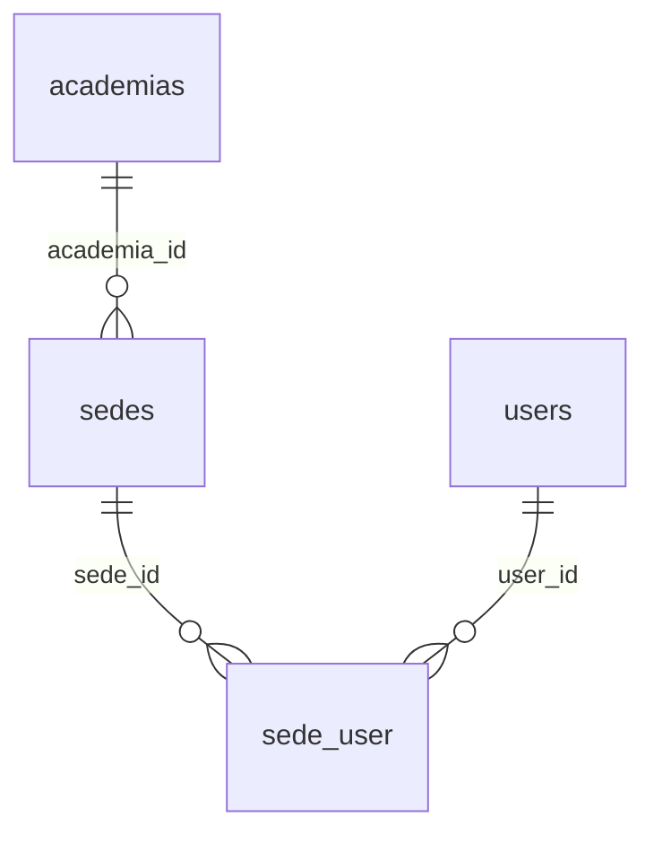

| Tabla | Columnas | FK |
|---|---|---|
| **academias** | nombre:str, logo:str (null), email:str (null), telefono:str (null), activo:bool | — |
| **sedes** | academia_id:fk, nombre:str, direccion:str (null), comuna:str (null), activo:bool, academia_id:index, tipo:str, privada:bool | `academia_id`→academias |
| **sede_user** | sede_id:fk, user_id:fk | `sede_id`→sedes, `user_id`→users |
| **users** | name:str, email:str (uniq), email_verified_at:ts (null), password:str, two_factor_secret:txt (null), two_factor_recovery_codes:txt (null), two_factor_confirmed_at:ts (null), academia_id:fk (null), rango_id:fk (null), supervisor_id:fk (null), telefono:str (null), activo:bool, academia_id:index | — |
| **cargos_rangos** | nombre:str, nivel:int, grado_dan:int (null), uniforme_gala:str (null), collar:str (null), grupo:str (null) | — |

## Alumnos

`estudiantes` es operativo (lleva `academia_id`). `grados` es catálogo compartido (escala de cinturones). Un alumno puede tener varios `programas` y varios apoderados (`users` con rol apoderado).

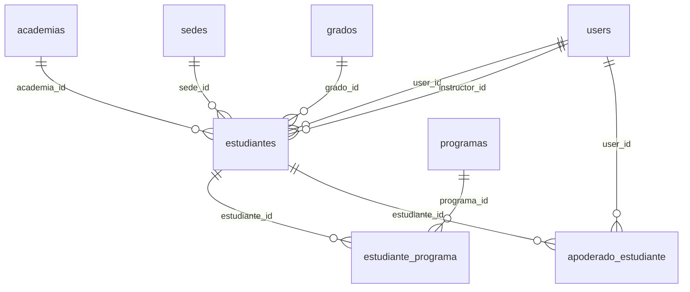

| Tabla | Columnas | FK |
|---|---|---|
| **estudiantes** | academia_id:fk, user_id:fk (null), sede_id:fk (null), grado_id:fk (null), nombre:str, rut:str (null), fecha_nacimiento:date (null), grupo_etario:str, nivel:str, telefono_contacto:str (null), email_contacto:str (null), activo:bool, academia_id:index, genero:str (null), direccion:str (null), region:str (null), comuna:str (null), apoderado_1:str (null), apoderado_2:str (null), telefono_contacto_2:str (null), email_contacto_2:str (null), dia_vencimiento:u8 (null), instructor_id:fk (null), acepto_reglamento:bool, acepto_reglamento_at:ts (null) | `academia_id`→academias, `user_id`→users, `sede_id`→sedes, `grado_id`→grados, `instructor_id`→users |
| **grados** | nombre:str, orden:int, escala:str, color:str (null), activo:bool, significado:txt (null), tipo:str, franjas:u8, estrellas:u8 | — |
| **programas** | nombre:str, descripcion:txt (null), tipo:str, edad_minima:int (null), activo:bool, orden:int | — |
| **estudiante_programa** | estudiante_id:fk, programa_id:fk | `estudiante_id`→estudiantes, `programa_id`→programas |
| **apoderado_estudiante** | user_id:fk, estudiante_id:fk | `user_id`→users, `estudiante_id`→estudiantes |

## Clases y asistencia

Clases multi-instructor (`clase_instructor` con papel). La asistencia se registra por clase+fecha. El calentamiento arma ejercicios por clase.

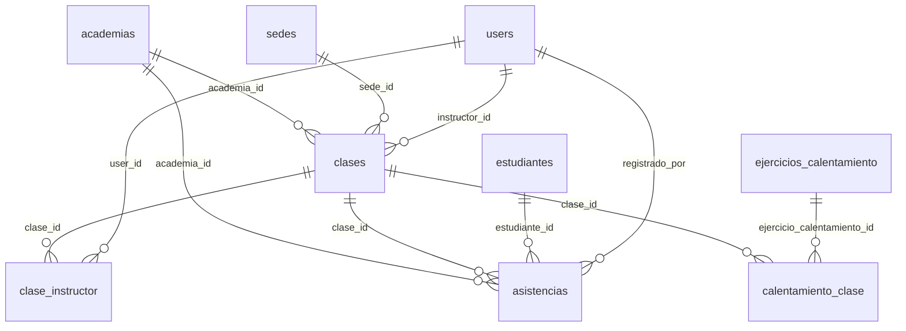

| Tabla | Columnas | FK |
|---|---|---|
| **clases** | academia_id:fk, sede_id:fk, instructor_id:fk (null), nombre:str, grupo_etario:str, nivel:str, dia_semana:u8, hora_inicio:time, hora_fin:time (null), activo:bool, academia_id:index, planilla_id:fk (null) | `academia_id`→academias, `sede_id`→sedes, `instructor_id`→users |
| **clase_instructor** | clase_id:fk, user_id:fk, papel:str | `clase_id`→clases, `user_id`→users |
| **asistencias** | academia_id:fk, clase_id:fk, estudiante_id:fk, registrado_por:fk (null), fecha:date, estado:str, academia_id:index | `academia_id`→academias, `clase_id`→clases, `estudiante_id`→estudiantes, `registrado_por`→users |
| **calentamiento_clase** | clase_id:fk, ejercicio_calentamiento_id:fk, orden:uint | `clase_id`→clases, `ejercicio_calentamiento_id`→ejercicios_calentamiento |

## Pagos

`configuraciones_pago` es 1–1 con la academia; `pagos` registra cada pago del alumno.

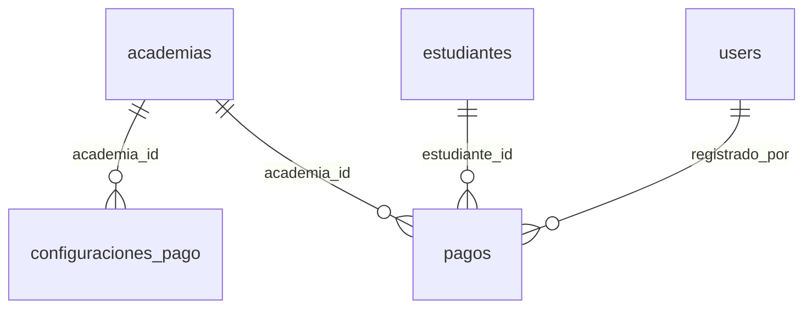

| Tabla | Columnas | FK |
|---|---|---|
| **configuraciones_pago** | academia_id:fk (uniq), valor_mensualidad:uint (null), valor_matricula:uint (null), dia_vencimiento:u8 (null), descuento_hermanos_pct:u8 | `academia_id`→academias |
| **pagos** | academia_id:fk, estudiante_id:fk, registrado_por:fk (null), tipo:str, periodo:date (null), monto:uint, fecha_pago:date, medio:str (null), academia_id:index | `academia_id`→academias, `estudiante_id`→estudiantes, `registrado_por`→users |

## Exámenes y graduaciones

El instructor inscribe alumnos a una convocatoria; al finalizar, las inscripciones aprobadas generan `graduaciones` (acreditadas a un `instructor_id`, base del conteo en cascada del collar).

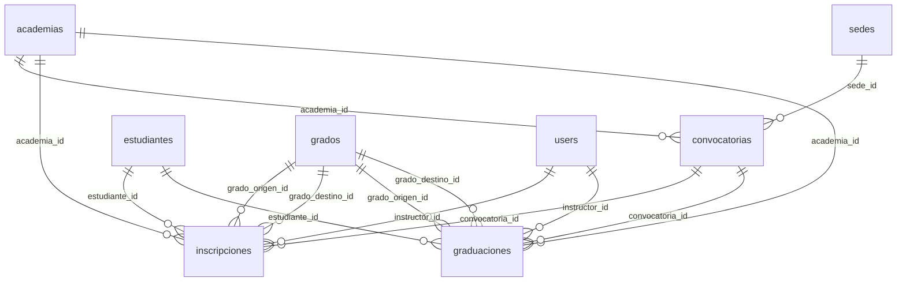

| Tabla | Columnas | FK |
|---|---|---|
| **convocatorias** | academia_id:fk, sede_id:fk (null), nombre:str, fecha:date, estado:str, academia_id:index | `academia_id`→academias, `sede_id`→sedes |
| **inscripciones** | academia_id:fk, convocatoria_id:fk, estudiante_id:fk, grado_origen_id:fk (null), grado_destino_id:fk (null), instructor_id:fk (null), visto_bueno:bool, resultado:str (null), nota:dec (null), observaciones:txt (null), academia_id:index | `academia_id`→academias, `convocatoria_id`→convocatorias, `estudiante_id`→estudiantes, `grado_origen_id`→grados, `grado_destino_id`→grados, `instructor_id`→users |
| **graduaciones** | academia_id:fk, estudiante_id:fk, convocatoria_id:fk (null), grado_origen_id:fk (null), grado_destino_id:fk (null), instructor_id:fk (null), fecha:date, resultado:str, nota:dec (null), academia_id:index, estudiante_id:index, instructor_id:index | `academia_id`→academias, `estudiante_id`→estudiantes, `convocatoria_id`→convocatorias, `grado_origen_id`→grados, `grado_destino_id`→grados, `instructor_id`→users |

## Formación / LMS ("Aprender")

Niveles → contenidos → progreso por usuario. Operativo (con `academia_id`).

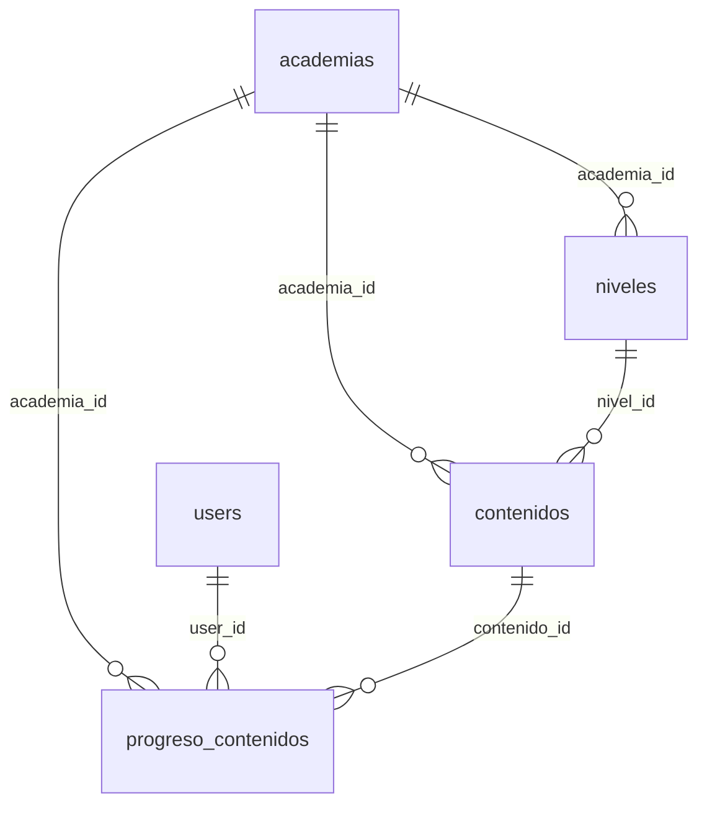

| Tabla | Columnas | FK |
|---|---|---|
| **niveles** | academia_id:fk, nombre:str, descripcion:txt (null), orden:int, activo:bool, academia_id:index | `academia_id`→academias |
| **contenidos** | academia_id:fk, nivel_id:fk, titulo:str, descripcion:txt (null), tipo:str, cuerpo:txt (null), url_recurso:str (null), orden:int, activo:bool, academia_id:index | `academia_id`→academias, `nivel_id`→niveles |
| **progreso_contenidos** | academia_id:fk, user_id:fk, contenido_id:fk, estado:str, visto_en:ts (null), academia_id:index | `academia_id`→academias, `user_id`→users, `contenido_id`→contenidos |

## Currículo ATA — Planificador

Todo catálogo compartido (SIN `academia_id`). `ciclos` = 6 Habilidades de Vida × 8 semanas; `planner_ciclo` es la grilla fila×bloque; `lecciones_vida` cuelga del ciclo. `planillas` (grupo×nivel) tienen bloques y cuadrantes. El planificador de Cinturón Negro va aparte (planificaciones/secciones/adaptaciones).

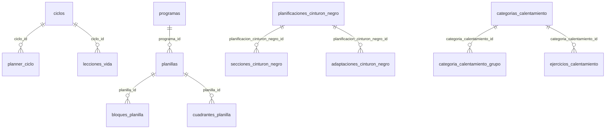

| Tabla | Columnas | FK |
|---|---|---|
| **ciclos** | habilidad_vida:str (uniq), nombre:str, orden:uint, semanas:uint | — |
| **planner_ciclo** | ciclo_id:fk, fila:str, bloque:str, contenido:txt (null) | `ciclo_id`→ciclos |
| **lecciones_vida** | semana:uint (uniq), habilidad:str, comienzo_texto:txt (null), comienzo_frase:str (null), durante_texto:txt (null), durante_frase:str (null), fin_texto:txt (null), fin_frase:str (null), ciclo_id:fk (null) | `ciclo_id`→ciclos |
| **planillas** | programa_id:fk (null), nombre:str, grupo_etario:str, nivel:str, habilidad_vida:str (null), activo:bool | `programa_id`→programas |
| **bloques_planilla** | planilla_id:fk, tipo:str, contenido:txt (null), orden:int, tiempo:str (null), titulo:str (null), cuadrante_texto:str (null), cuadrante_color:str (null) | `planilla_id`→planillas |
| **cuadrantes_planilla** | planilla_id:fk, cuadrante:str, nota:txt (null) | `planilla_id`→planillas |
| **curriculos_nivel** | nivel:str (uniq), formula:str (null), defensa:str (null), patadas:txt (null), combinaciones:json (null), roturas:txt (null) | — |
| **planificaciones_cinturon_negro** | clave:str (uniq), label:str, tema:str, icono:str (null), color:str (null), orden:uint | — |
| **secciones_cinturon_negro** | planificacion_cinturon_negro_id:fk, seccion:str, item:txt, orden:uint | `planificacion_cinturon_negro_id`→planificaciones_cinturon_negro |
| **adaptaciones_cinturon_negro** | planificacion_cinturon_negro_id:fk, grupo_etario:str, texto:txt | `planificacion_cinturon_negro_id`→planificaciones_cinturon_negro |
| **categorias_calentamiento** | clave:str (uniq), nombre:str, color:str (null), orden:uint | — |
| **categoria_calentamiento_grupo** | categoria_calentamiento_id:fk, grupo_etario:str | `categoria_calentamiento_id`→categorias_calentamiento |
| **ejercicios_calentamiento** | categoria_calentamiento_id:fk, nombre:str, descripcion:txt (null), orden:uint | `categoria_calentamiento_id`→categorias_calentamiento |
| **notas_calentamiento** | grupo_etario:str (uniq), nota:txt | — |

## Currículo ATA — Técnicas y grados

Biblioteca de técnicas con su paso a paso; `grado_tecnica` enlaza técnica ↔ cinturón. `cuadrante_items` = marco pedagógico de los Cuadrantes de Enseñanza.

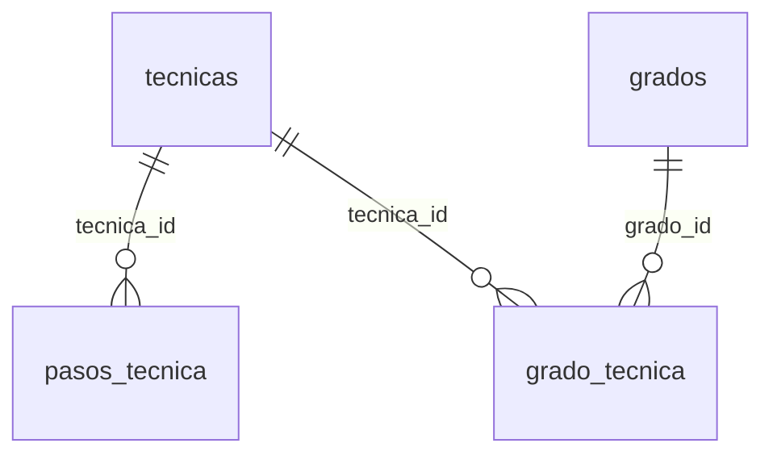

| Tabla | Columnas | FK |
|---|---|---|
| **tecnicas** | categoria:str, subcategoria:str (null), nombre:str, descripcion:txt (null), modalidad:str (null), cinturon:str (null), nivel:str (null), core:bool, significado:str (null), orden:uint, fuente:str (null) | — |
| **pasos_tecnica** | tecnica_id:fk, segmento:str (null), orden:uint, texto:txt, lado:str (null), postura:str (null), seccion:str (null) | `tecnica_id`→tecnicas |
| **grado_tecnica** | grado_id:fk, tecnica_id:fk | `grado_id`→grados, `tecnica_id`→tecnicas |
| **cuadrante_items** | cuadrante:str, rol:str, orden:uint, texto:str, detalle:txt (null) | — |

## Cuestionarios

Catálogo (cuestionario→preguntas→opciones) + operativo (intento→respuestas→opciones marcadas). El intento nace en revisión y el examinador lo aprueba/reintenta.

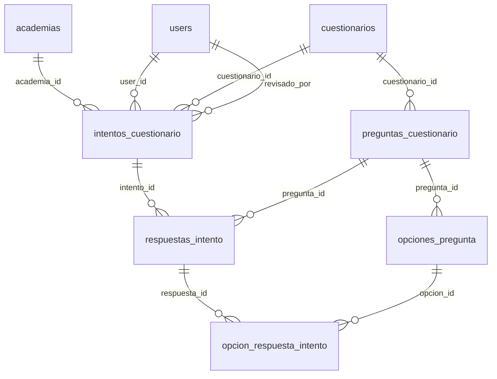

| Tabla | Columnas | FK |
|---|---|---|
| **cuestionarios** | titulo:str, descripcion:txt (null), area:str (null), umbral_aprobacion:u8, activo:bool, orden:uint | — |
| **preguntas_cuestionario** | cuestionario_id:fk, enunciado:txt, explicacion:txt (null), nota:txt (null), orden:uint | `cuestionario_id`→cuestionarios |
| **opciones_pregunta** | pregunta_id:fk, texto:txt, correcta:bool, orden:uint | `pregunta_id`→preguntas_cuestionario |
| **intentos_cuestionario** | academia_id:fk (null), user_id:fk, cuestionario_id:fk, correctas:uint, total:uint, porcentaje:u8, aprobado:bool, finalizado_at:ts (null), estado:str, revisado_por:fk (null), revisado_at:ts (null), justificacion:txt (null) | `academia_id`→academias, `user_id`→users, `cuestionario_id`→cuestionarios, `revisado_por`→users |
| **respuestas_intento** | intento_id:fk, pregunta_id:fk, correcta:bool | `intento_id`→intentos_cuestionario, `pregunta_id`→preguntas_cuestionario |
| **opcion_respuesta_intento** | respuesta_id:fk, opcion_id:fk | `respuesta_id`→respuestas_intento, `opcion_id`→opciones_pregunta |

## Recompensas / gamificación

`recompensas` catálogo compartido; `logros` = recompensa otorgada a un alumno.

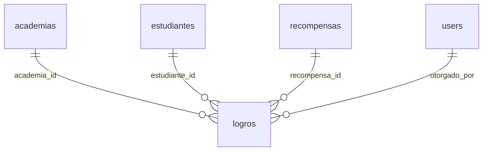

| Tabla | Columnas | FK |
|---|---|---|
| **recompensas** | tipo:str, nombre:str, descripcion:txt (null), habilidad_vida:str (null), grupo_etario:str (null), color:str (null), emoji:str (null), repetible:bool, orden:uint, activo:bool | — |
| **logros** | academia_id:fk (null), estudiante_id:fk, recompensa_id:fk, otorgado_por:fk (null), nota:txt (null), otorgado_at:ts (null) | `academia_id`→academias, `estudiante_id`→estudiantes, `recompensa_id`→recompensas, `otorgado_por`→users |

## Programa Legacy

Track de formación de instructores: niveles (100 h) + requisitos (uno puede exigir un cuestionario). Operativo: inscripción, horas y cumplimiento de requisitos.

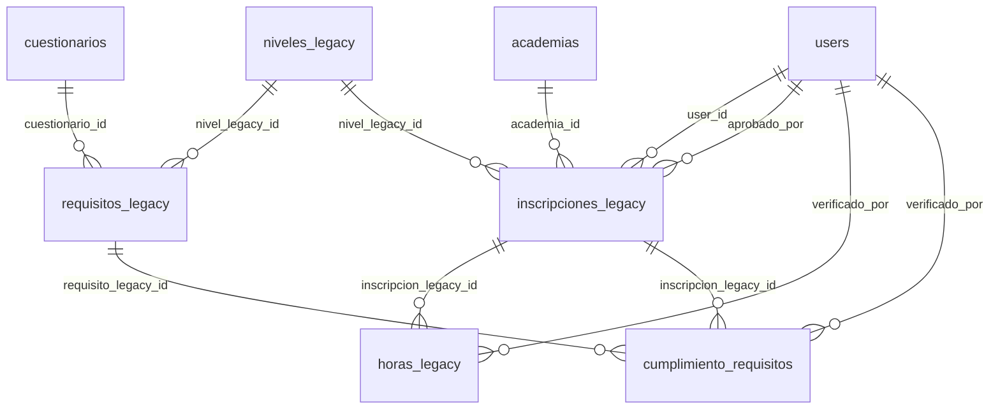

| Tabla | Columnas | FK |
|---|---|---|
| **niveles_legacy** | nombre:str, orden:uint, horas_requeridas:uint, descripcion:txt (null) | — |
| **requisitos_legacy** | nivel_legacy_id:fk, texto:str, cuestionario_id:fk (null), orden:uint | `nivel_legacy_id`→niveles_legacy, `cuestionario_id`→cuestionarios |
| **inscripciones_legacy** | academia_id:fk (null), user_id:fk, nivel_legacy_id:fk, estado:str, fecha_inicio:date (null), fecha_aprobacion:date (null), aprobado_por:fk (null), nota:txt (null) | `academia_id`→academias, `user_id`→users, `nivel_legacy_id`→niveles_legacy, `aprobado_por`→users |
| **horas_legacy** | inscripcion_legacy_id:fk, fecha:date, horas:dec, descripcion:str (null), verificado_por:fk (null) | `inscripcion_legacy_id`→inscripciones_legacy, `verificado_por`→users |
| **cumplimiento_requisitos** | inscripcion_legacy_id:fk, requisito_legacy_id:fk, verificado_por:fk (null), verificado_at:ts (null) | `inscripcion_legacy_id`→inscripciones_legacy, `requisito_legacy_id`→requisitos_legacy, `verificado_por`→users |

